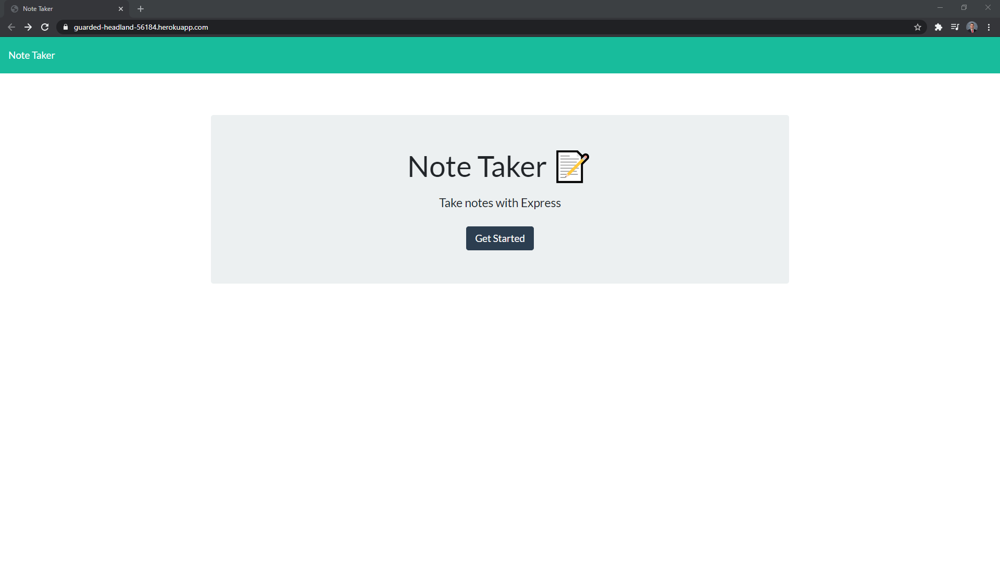
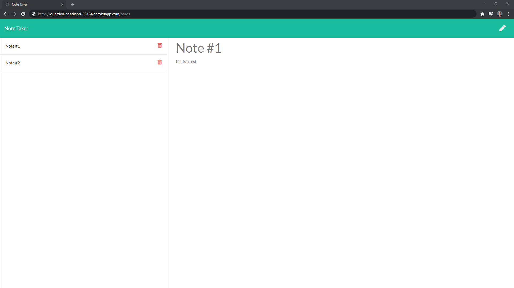

# week-11-express-note-taker

## Media links:


## Description
This application allows a user to make notes for themselves that save onto a local server for further use.  This application makes use of routes as well as api data.

 ## Table of contents

-[Installation](#installation)

-[Usage](#usage)

-[License](#license)

-[Contributing](#contributing)

-[Tests](#tests)

-[Questions](#questions)

## Installation

In order to run this script you have to have the following things downloaded using npm i.
```
express
```

## Usage

This repo uis deployed using heroku.  Once launched you just need to click the start button and begin typing notes.  Once you have typed your note you can then save that note and write another if you so choose.
## License

N/A


## Contributing
Contributing to this file is not yet available as it is a personal homework project.  Check back in the future for other projects to contribute on.

## Tests

To run tests, run the following command:

```
N/A
```

## Questions

### Github:
github.com/GreysonMainor

### Email:
gbmainor98@outlook.com
  